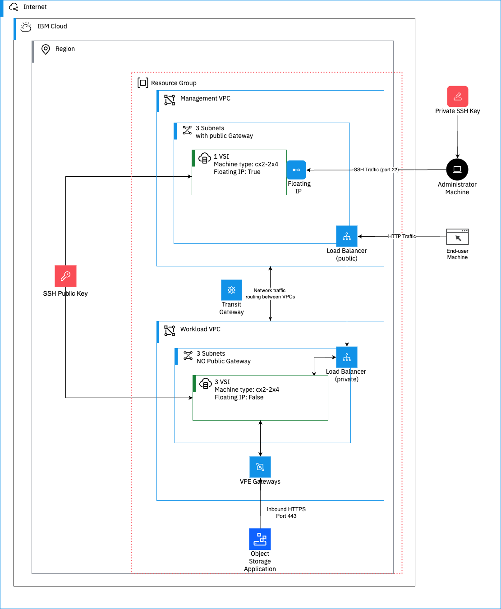

---

copyright:
  years: 2025
lastupdated: "2025-12-18"

keywords: Secure Hub-and-Spoke, Terraform IBM Modules, TIM Modules

subcollection: ibm-cloud-provider-for-terraform

---

{{site.data.keyword.attribute-definition-list}}

# Build a Secure Hub-and-Spoke Infrastructure Using Terraform IBM Modules
{: #hub-spoke-infrastructure}
{: toc-content-type="tutorial"}
{: toc-services="terraform, tim, tim-modules"}
{: toc-completion-time="2h"}

This tutorial demonstrates how to build a complete **Infrastructure as Code (IaC)** solution on IBM Cloud using [Terraform IBM Modules](https://github.com/terraform-ibm-modules). Rather than defining individual cloud resources, we focus on **assembling, integrating, and composing Terraform modules** into a cohesive, reusable solution. The infrastructure you’ll build is based on a **secure hub-and-spoke model**.
{: shortdesc}


{: figure caption="IBM Cloud Hub-and-Spoke Infrastructure."}

This tutorial uses a **hub-and-spoke network architecture**, a standard pattern for isolating environments and controlling traffic flow. The design separates the **Management (Hub)** and **Workload (Spoke)** environments for better security and organization. The hub provides a secure entry point for administration and traffic, while the spokes host applications in an isolated environment. You will explore this architecture in detail in the next section.

The deployment architecture uses these core components:

- **Management VPC (Hub)**
  - **Jumpbox Server**: Secure gateway for administrators to access workload servers. The only component reachable from the public internet (via SSH).
  - **Public Load Balancer**: Routes incoming traffic to the private load balancer in the Workload VPC, keeping workload servers isolated.
- **Workload VPC (Spoke)**
  - **Workload Servers**: Private virtual servers hosting applications, without direct internet access.
  - **Private Load Balancer**: Distributes traffic from the public load balancer to workload servers.
- **Secure Connectivity**
  - **Transit Gateway**: Connects Management and Workload VPCs over the private IBM Cloud backbone.
  - **Security Groups & Network ACLs**: Firewall rules that control traffic between the components.
- **Private Access to IBM Cloud Services**
  - **Virtual Private Endpoints (VPEs)**: Enable private connections from workload servers to IBM Cloud services, such as Cloud Object Storage.

## Before you begin
{: #tim-modules-hub-and-spoke-prereqs}

Before you begin this tutorial, ensure you have the required tools, skills, and familiarity with IBM Cloud services. Meeting these prerequisites will help you successfully provision infrastructure using Terraform modules and deploy the hub-and-spoke network architecture.

* [Install the {{site.data.keyword.cloud_notm}} CLI](https://cloud.ibm.com/docs/cli?topic=cli-getting-started).
* [Install terraform CLI](https://developer.hashicorp.com/terraform/install).
* [Basic knowledge of Terraform syntax and workflows](https://developer.hashicorp.com/terraform/tutorials).
* [Understanding of IBM Cloud services](https://www.ibm.com/solutions/cloud).
* [IBM Cloud apikey](/docs/account?topic=account-userapikey&interface=ui) to access the IBM Cloud.

## Set up Terraform project structure for TIM-Based IaC
{: #tim-setup-project-structure}
{: step}

Before provisioning any resources, you need to set up a clean Terraform project structure. This ensures your infrastructure is modular, maintainable, and ready for TIM-based deployments.

### Create a new empty project folder
{: #createHubSpoke-project-folder}
{: step}

Start by creating a dedicated folder for your Terraform project. This folder will contain all configuration files for your infrastructure deployment.

**In your terminal, run:**

```bash
mkdir my-terraform-project
cd my-terraform-project
```
{: pre}

### Create the necessary Terraform files
{: #hubspoke_createterraform-files}
{: step}

The project follows a standard Terraform layout, where each file serves a single purpose. This structure promotes clarity, reuse, and predictable behavior. Refer [this](/docs/ibm-cloud-provider-for-terraform?topic=ibm-cloud-provider-for-terraform-understand-tim-structure) for more information.

```sh
.
├── main.tf            # Infrastructure components (modules & resources)
├── variables.tf       # Input variable definitions
├── outputs.tf         # Exported outputs
├── providers.tf       # Provider configuration
├── version.tf         # Terraform version constraints
└── terraform.tfvars   # Input values for deployment
```

You can create all the required files at once.

**In your terminal, run:**

```sh
touch main.tf variables.tf outputs.tf providers.tf version.tf terraform.tfvars
```
{: pre}

## Set up IBM Cloud provider
{: #tim-setup-ibmcloud-provider}
{: step}

Before you can provision any resources, Terraform needs to know **how to connect to IBM Cloud**. In this step, you will configure the IBM Cloud provider and specify required provider versions to ensure compatibility. This involves updating two files: `providers.tf` and `version.tf`.

### Configure the IBM Cloud and REST API providers
{: #tim-configure-providers}
{: step}

The `providers.tf` file tells Terraform how to authenticate with IBM Cloud and interact with services.

Add the following content to `providers.tf`:

```hcl
provider "ibm" {
  ibmcloud_api_key = var.ibmcloud_api_key
  region           = var.region
}
```
{: pre}

Make sure your IBM Cloud API key and region are defined as input variables in `variables.tf`.
{: note}

### Specify Terraform and provider versions
{: #hubspoke_terraform-version}
{: step}

The `version.tf` file ensures that Terraform uses the correct version and compatible provider versions for IBM Cloud.

Add the following content to `version.tf`:

```hcl
terraform {
  required_version = ">= 1.9.0"
  required_providers {
    ibm = {
      source  = "IBM-Cloud/ibm"
      version = ">= 1.80.4"
    }
  }
}
```
{: pre}

## Define input variables
{: #hubspoke_define-input-variables}
{: step}

To make your Terraform configuration **flexible and reusable**, you define input variables that allow you to manage sensitive information, environment-specific values, and configuration parameters outside of your main code. In this step, you will define the required variables `ibmcloud_api_key` and `prefix`, as well as the optional variable `region`, enabling different environments (dev, test, prod) to use the same Terraform code with different values.

Add the following content to `variables.tf`:

```hcl
variable "ibmcloud_api_key" {
  type        = string
  description = "The IBM Cloud API key."
  sensitive   = true
}

variable "prefix" {
  type        = string
  description = "The prefix to be added to all resources name created by this solution."
}

variable "region" {
  type        = string
  description = "IBM Cloud region where resources will be deployed"
  default     = "us-south"
}
```
{: pre}

**Tip**: Required variables must be provided either via terraform.tfvars or environment variables. Optional variables can remain unset, in which case Terraform will use the default value.
{: note}

## Configure the Network Foundation
{: #tim-configure-network-foundation}
{: step}

In this step, you will define the main network infrastructure for your `hub-and-spoke` deployment using **IBM Cloud Terraform modules**. The `main.tf` file orchestrates all core components in a structured and consistent way. Resources use the `${var.prefix}-` naming convention to **avoid conflicts and maintain uniform naming**.

The following components will be created in sequence:

- **Management VPC (Hub):** Jumpbox for secure access, public load balancer for incoming traffic.
- **Workload VPC (Spoke):** Application servers in private subnets, private load balancer for traffic distribution.
- **Secure Connectivity:** Transit gateway, security groups, and ACLs control communication between components.
- **Private Service Access:** Virtual Private Endpoints (VPEs) enable private access to IBM Cloud services.

This approach ensures a **secure, organized, and scalable** infrastructure deployment.

### Create a Resource Group (Foundation)
{: #hubspoke_create-resource-group}
{: step}

A **resource group** is a logical container for IBM Cloud resources used for organization, IAM access control, and lifecycle management.
This module typically acts as the **root dependency** for all other modules.

Add the following code to your `main.tf` file:

```hcl
module "resource_group" {
  source              = "terraform-ibm-modules/resource-group/ibm"
  version             = "1.4.0"
  resource_group_name = "${var.prefix}-resource-group"
}
```
{: pre}

### Create the Management VPC (The Hub)
{: #tim-management-vpc}
{: step}

You will create the **Management VPC**, which acts as the secure entry point for your hub-and-spoke infrastructure. This VPC hosts the jumpbox server and provides controlled internet access. We use the [terraform-ibm-landing-zone-vpc](https://github.com/terraform-ibm-modules/terraform-ibm-landing-zone-vpc) module to define the VPC, its subnets across three availability zones, and the necessary network ACLs for secure traffic management.

The following elements are configured in sequence:

- **High availability:** Subnets across three availability zones.
- **Network ACLs:** Stateful and custom rules for inbound/outbound traffic.
- **Public access:** Jumpbox and public load balancer with controlled internet connectivity.
- **Subnet IP ranges:** Logical separation of resources per availability zone.

Add the following code to `main.tf`:

```hcl
module "management_vpc" {
  source            = "terraform-ibm-modules/landing-zone-vpc/ibm"
  version           = "8.10.1"
  resource_group_id = module.resource_group.resource_group_id
  region            = "us-south"
  name              = "${var.prefix}-management-vpc"
  network_acls = [{
    name                         = "management-network-acl"
    add_ibm_cloud_internal_rules = true
    add_vpc_connectivity_rules   = true
    prepend_ibm_rules            = true
    rules = [
      {
        name      = "allow-ssh-from-internet"
        action    = "allow"
        direction = "inbound"
        tcp = {
          port_min = 22
          port_max = 22
        }
        source      = "0.0.0.0/0"
        destination = "0.0.0.0/0"
      },
      {
        name      = "allow-http-from-internet"
        action    = "allow"
        direction = "inbound"
        tcp = {
          port_min = 80
          port_max = 80
        }
        source      = "0.0.0.0/0"
        destination = "0.0.0.0/0"
      },
      {
        name        = "allow-workload-to-management-traffic"
        action      = "allow"
        direction   = "inbound"
        source      = "10.10.0.0/20"  # workload vpc range
        destination = "0.0.0.0/0"
      },
      {
        name        = "allow-all-outbound-traffic"
        action      = "allow"
        direction   = "outbound"
        destination = "0.0.0.0/0"
        source      = "0.0.0.0/0"
      }
    ]
  }]
  subnets = {
    zone-1 = [
      {
        name           = "management-subnet-zone1"
        cidr           = "10.0.0.0/22"
        public_gateway = true
        acl_name       = "management-network-acl"
      }
    ],
    zone-2 = [
      {
        name           = "management-subnet-zone2"
        cidr           = "10.0.4.0/22"
        public_gateway = true
        acl_name       = "management-network-acl"
      }
    ],
    zone-3 = [
      {
        name           = "management-subnet-zone3"
        cidr           = "10.0.8.0/22"
        public_gateway = true
        acl_name       = "management-network-acl"
      }
    ]
  }
}
```
{: pre}

For more information about this module, see the [terraform-ibm-landing-zone-vpc documentation](https://github.com/terraform-ibm-modules/terraform-ibm-landing-zone-vpc/blob/main/README.md).
{: note}

<details>
<summary>Code Breakdown</summary>

**1. High Availability and Resiliency**

  - Subnets are defined across **three Availability Zones** (`zone-1`, `zone-2`, `zone-3`) in the `us-south` region.
  - Each AZ is a **physically separate data center**, so distributing resources ensures **high availability** even if one AZ goes down.
  - This is a **key principle for building resilient cloud architectures**.

**2. CIDR Ranges**

  - The VPC uses the `10.0.0.0/20` address space, providing **over 4,000 IP addresses**.
  - Each subnet gets a `/22` block (e.g., `10.0.0.0/22`, `10.0.4.0/22`, `10.0.8.0/22`):
    - Keeps IP addresses **logically separated per availability zone**.
    - Provides **enough IPs** for all resources in each zone.

**3. Public Gateway vs. Floating IP**

  - **Floating IP**: Will be attached to the jumpbox server later. Provides a **static public IP** for inbound connections (e.g., SSH).
  - **Public Gateway (`public_gateway = true`)**: Allows resources in the subnet to **initiate outbound connections** (e.g., downloading software updates). Recommended for jumpboxes.

**4. Network ACLs**

  - A **Network ACL** is a **stateless firewall** controlling inbound and outbound traffic for subnets.
  - The `terraform-ibm-landing-zone-vpc` module simplifies ACL management:
    - `add_ibm_cloud_internal_rules = true`: allows traffic between all subnets in the same VPC.
    - `add_vpc_connectivity_rules = true`: allows access to common IBM Cloud services (like DNS).
  - Custom rules in this example:
    - `allow-ssh-from-internet`: Inbound SSH (port 22) from anywhere.
    - `allow-http-from-internet`: Inbound HTTP (port 80) from anywhere.
    - `allow-workload-to-management-traffic`: Traffic from **Workload VPC** (`10.10.0.0/20`) to Management VPC.
    - `allow-all-outbound-traffic`: All outbound traffic from resources inside the Management VPC.

</details>

### Create the Workload VPC (The Spoke)
{: #tim-workload-vpc}
{: step}

In this step, you will create the **Workload VPC**, which hosts your application servers. Unlike the Management VPC, this VPC is **private** with **no direct internet access**, improving security and reducing exposure to external threats. This module sets up subnets, network ACLs, and connectivity rules to allow controlled communication with the Management VPC.

The following elements are configured in sequence:

- **CIDR Ranges:** Separate address space from the Management VPC for proper routing.
- **Private Subnets:** No public gateways to prevent direct internet access.
- **Network ACLs:** Allow traffic only between Management and Workload VPCs, securing the environment.

Add the following code to `main.tf`

```hcl
module "workload_vpc" {
  source            = "terraform-ibm-modules/landing-zone-vpc/ibm"
  version           = "8.10.1"
  resource_group_id = module.resource_group.resource_group_id
  region            = "us-south"
  name              = "${var.prefix}-workload-vpc"
  network_acls = [{
    name                         = "workload-network-acl"
    add_ibm_cloud_internal_rules = true
    add_vpc_connectivity_rules   = true
    prepend_ibm_rules            = true
    rules = [
      {
        name        = "allow-management-to-workload-traffic"
        action      = "allow"
        direction   = "inbound"
        source      = "10.0.0.0/20"  # management vpc range
        destination = "10.10.0.0/20" # workload vpc range
      },
      {
        name        = "allow-workload-to-management-traffic"
        action      = "allow"
        direction   = "outbound"
        source      = "10.10.0.0/20" # workload vpc range
        destination = "10.0.0.0/20"  # management vpc range
      }
    ]
  }]
  subnets = {
    zone-1 = [
      {
        name           = "workload-subnet-zone1"
        cidr           = "10.10.0.0/22"
        public_gateway = false # No direct internet access for security
        acl_name       = "workload-network-acl"
      }
    ],
    zone-2 = [
      {
        name           = "workload-subnet-zone2"
        cidr           = "10.10.4.0/22"
        public_gateway = false
        acl_name       = "workload-network-acl"
      }
    ],
    zone-3 = [
      {
        name           = "workload-subnet-zone3"
        cidr           = "10.10.8.0/22"
        public_gateway = false
        acl_name       = "workload-network-acl"
      }
    ]
  }
}
```
{: pre}

For more information about this module, see the [terraform-ibm-landing-zone-vpc documentation](https://github.com/terraform-ibm-modules/terraform-ibm-landing-zone-vpc/blob/main/README.md).
{: note}

<details>
<summary>Code Breakdown</summary>

**1. CIDR Ranges**
  - The Workload VPC uses the `10.10.0.0/20` address space.
  - Make sure it **does not overlap** with the Management VPC (`10.0.0.0/20`) to ensure proper routing between the two VPCs.

**2. Private Subnets**
  - `public_gateway = false` is a **key security feature**.
  - By setting this to `false`, the virtual servers in this VPC cannot initiate connections to the public internet, nor can they be reached from it directly.

**3. Network ACLs**
  - ACLs are configured to **allow traffic only between the Management VPC (`10.0.0.0/20`) and the Workload VPC (`10.10.0.0/20`)**.
  - All other traffic is **implicitly denied by default**, creating a **secure, isolated environment** for your application servers.
</details>

### Connect the VPCs with a Transit Gateway
{: #tim-transit-gateway}
{: step}

To **enable private communication** between the Management and Workload VPCs, you will create a **Transit Gateway**.

Add the following code to `main.tf`:

```hcl
module "transit_gateway" {
  source                    = "terraform-ibm-modules/transit-gateway/ibm"
  version                   = "2.5.8"
  transit_gateway_name      = "${var.prefix}-management-workload-tg"
  region                    = "us-south"
  global_routing            = false
  resource_group_id         = module.resource_group.resource_group_id
  vpc_connections           = [{ vpc_crn = module.management_vpc.vpc_crn }, { vpc_crn = module.workload_vpc.vpc_crn }]
  classic_connections_count = 0
}
```
{: pre}

For more information about this module, see the [terraform-ibm-transit-gateway documentation](https://github.com/terraform-ibm-modules/terraform-ibm-transit-gateway/blob/main/README.md).
{: note}

## Configure variables and deploy the infrastructure
{: #hubspoke_deployInfra}
{: step}

In this step, you will configure your environment-specific variables and deploy the complete infrastructure using Terraform. This includes initializing modules, previewing planned changes, and applying the configuration to provision resources in IBM Cloud.

For more details about TIM module deployments, see [Deploy TIM Module guide](/docs/ibm-cloud-provider-for-terraform?topic=ibm-cloud-provider-for-terraform-deploy-tim-module) or learn more about deployment best practices.
{: note}

### Secure variables
{: #hubSpoke_secure-variables}
{: step}

Create or update the `terraform.tfvars` file with your environment-specific values:

```hcl
ibmcloud_api_key = "<your-IBM-cloud-api-key>"  # Set your IBM Cloud API key
prefix           = "<your-prefix>"   # Set the prefix for resource names
region           = "us-south"        # Set the IBM Cloud region
```
{: pre}

**Guidelines:**
1. Replace `<your-IBM-cloud-api-key>` with your actual IBM Cloud API key.
2. Replace `<your-prefix>` with a short, unique prefix for your resources.
3. Keep `region` as `"us-south"` unless you need a different deployment region.
4. Ensure this file is **not checked into source control** as it contains sensitive information.

### Deploy the infrastructure
{: #hubSpoke_deployInfra}
{: step}

Open a terminal and run the following commands to deploy the infrastructure:

```bash
terraform init   # Initialize providers and modules
terraform plan   # Preview changes without applying
terraform apply  # Apply changes (type 'yes' when prompted)
```
{: pre}

After running `terraform apply`, your newly created resources will be provisioned and visible in the IBM Cloud console. You can inspect them by opening the VPC console in a private browser window where you are logged into your target [IBM Cloud account](https://cloud.ibm.com/infrastructure/network/vpcs).
{: note}

---

So far, we have built and deployed the network foundation, including Management and Workload VPCs, secure connectivity, and private access to IBM Cloud services. With the network in place, we can now provision servers, starting with SSH keys, the jumpbox, and workload servers with their private load balancer.

## Create an SSH Key for Server Access
{: #tim-ssh-key}
{: step}

To securely connect to your virtual servers, you need an **SSH key pair**. In this step, you will generate a new key pair, upload the public key to IBM Cloud, and save the private key locally. This allows you to securely SSH into your servers while keeping the private key confidential.

The following actions are performed in sequence:

- **Generate a key pair:** Creates a new RSA key pair for server authentication.
- **Store the private key locally:** Saves the key to `<your-prefix>_ssh_private_key.pem` (read-only for the owner).
- **Upload the public key to IBM Cloud:** Makes it available for server provisioning.

Add the following code to `main.tf`:

```hcl
# Generate SSH key pair for secure server access
resource "tls_private_key" "ssh_key" {
  algorithm = "RSA"
  rsa_bits  = 4096
}

# Store private key locally (TUTORIAL ONLY - use secure key management in production)
resource "local_file" "ssh_private_key" {
  content         = tls_private_key.ssh_key.private_key_pem
  filename        = "${path.module}/${var.prefix}_ssh_private_key.pem"
  file_permission = "0600" # Read-only for owner
}

resource "ibm_is_ssh_key" "ssh_key" {
  name       = "${var.prefix}-ssh-key"
  public_key = tls_private_key.ssh_key.public_key_openssh
}
```
{: pre}

Saving private keys directly to the filesystem is done here for tutorial simplicity. In a production environment, you should use a secure secret management tool like **IBM Cloud Secrets Manager**.
{: note}


## Provision the Jumpbox Server
{: #tim-jumpbox-server}
{: step}

In this step, you will provision a **jumpbox server** in the Management VPC to provide secure remote access to your infrastructure. The jumpbox is assigned a **public IP** and configured with security rules to control inbound and outbound traffic. We use the [VSI landing zone module](https://github.com/terraform-ibm-modules/terraform-ibm-landing-zone-vsi) to simplify deployment.

The following elements are configured in sequence:

- **Security Groups:** Protect the jumpbox and allow controlled access.
- **Floating IP:** Assigns a public IP for SSH connectivity.
- **VSI Configuration:** Defines instance type, subnet placement, and SSH key access.

Add the following code to `main.tf`:

```hcl
module "jumpbox_server" {
  source                = "terraform-ibm-modules/landing-zone-vsi/ibm"
  version               = "v5.20.1"
  create_security_group = true
  image_id              = "r006-ca75f893-8675-47b0-b35d-9f847abc95e3" # Debian 12 minimal
  enable_floating_ip    = true
  security_group = {
    name = "jumpbox-security-group"
    rules = [
      {
        name      = "allow-ssh-from-internet"
        direction = "inbound"
        source    = "0.0.0.0/0" # Restrict to your IP in production
        tcp = {
          port_min = 22
          port_max = 22
        }
        udp  = null
        icmp = null
      },
      {
        name        = "allow-ssh-to-workload-servers"
        direction   = "outbound"
        source      = "0.0.0.0/0"
        destination = "10.10.0.0/20" # workload VPC range
        tcp = {
          port_min = 22
          port_max = 22
        }
      },
      {
        name        = "allow-ping-to-workload-servers"
        direction   = "outbound"
        source      = "0.0.0.0/0"
        destination = "10.10.0.0/20" # workload VPC range
        icmp = {
          type = 8 # Echo request (ping)
          code = 0
        }
      }
    ]
  }
  machine_type      = "cx2-2x4"
  prefix            = "${var.prefix}-jumpbox"
  resource_group_id = module.resource_group.resource_group_id
  ssh_key_ids       = [ibm_is_ssh_key.ssh_key.id]
  subnets           = [module.management_vpc.subnet_zone_list[0]]
  user_data         = null
  vpc_id            = module.management_vpc.vpc_id
  vsi_per_subnet    = 1
}
```
{: pre}

For more information about this module, see the [terraform-ibm-landing-zone-vsi documentation](https://github.com/terraform-ibm-modules/terraform-ibm-landing-zone-vsi/blob/main/README.md).
{: note}

<details>
<summary>Code Breakdown</summary>

**1. Security Groups vs. Network ACLs:**
  In this step, the `landing-zone-vsi` module creates a **Security Group** for the jumpbox. It’s important to understand the difference between these two VPC firewalls:
  - **Network ACLs:** Stateless, operate at the **subnet level**, and require explicit rules for both inbound and outbound traffic.
  - **Security Groups:** Stateful, operate at the **instance (VSI) level**, and automatically allow return traffic for permitted inbound connections. They act as a virtual firewall for your servers and simplify rule management.

**2. `enable_floating_ip = true`:**
  This setting provisions and attaches a **public Floating IP** to the jumpbox, making it accessible from the internet. The assigned IP is available in the `jumpbox_public_ip` output.

</details>

## Provision the Workload Servers and Private Load Balancer
{: #tim-workload-servers}
{: step}

In this step, you will provision **workload servers** in the private Workload VPC and set up a **private load balancer** to distribute traffic to these servers. The jumpbox server in the Management VPC will be the only direct access point, ensuring the workload servers remain isolated from the public internet.

The following actions are performed in sequence:

- **Workload Servers:** Deploy Debian 12 minimal instances in private subnets.
- **Security Groups:** Restrict access to only the jumpbox and load balancer, while allowing outbound DNS and HTTPS calls.
- **Private Load Balancer:** Distributes incoming traffic from the Management VPC to workload servers using round-robin algorithm.

Add the following code to `main.tf`:

```hcl
module "workload_servers" {
  source                = "terraform-ibm-modules/landing-zone-vsi/ibm"
  version               = "v5.5.0"
  create_security_group = true
  image_id              = "r006-ca75f893-8675-47b0-b35d-9f847abc95e3" # Debian 12 minimal
  security_group = {
    name = "workload-server-security-group"
    rules = [
      {
        name      = "allow-ssh-from-jumpbox"
        direction = "inbound"
        source    = module.management_vpc.subnet_zone_list[0].cidr
        tcp = {
          port_min = 22
          port_max = 22
        }
        udp  = null
        icmp = null
      },
      {
        name      = "allow-ping-from-jumpbox"
        direction = "inbound"
        source    = module.management_vpc.subnet_zone_list[0].cidr
        icmp = {
          type = 8 # Echo request (ping)
          code = 0
        }
      },
      {
        name      = "allow-dns-resolution"
        direction = "outbound"
        source    = null
        tcp       = null
        udp = {
          port_min = 53
          port_max = 53
        }
        icmp = null
      },
      {
        name      = "allow-https-api-calls"
        direction = "outbound"
        source    = null
        tcp = {
          port_min = 443
          port_max = 443
        }
        udp  = null
        icmp = null
      },
      {
        name      = "allow-loadbalancer-to-app"
        direction = "inbound"
        source    = "10.10.0.0/20" # workload vpc range - private LB located here
        tcp = {
          port_min = 8080 # application port
          port_max = 8080
        }
        udp  = null
        icmp = null
      }
    ]
  }
  load_balancers = [{
    name                       = "${var.prefix}-private-lb"
    type                       = "private"
    algorithm                  = "round_robin"
    protocol                   = "http"
    listener_protocol          = "http"
    listener_port              = 80
    pool_member_port           = "8080"
    health_type                = "http"
    connection_limit           = 80
    health_delay               = 5
    health_retries             = 3
    health_timeout             = 2
    subnet_id_to_provision_nlb = module.workload_vpc.subnet_zone_list[0].id

    security_group = {
      name = "private-loadbalancer-security-group"
      rules = [
        {
          name      = "allow-http-from-management"
          direction = "inbound"
          source    = "10.0.0.0/20" # management CIDR
          tcp = {
            port_min = 80
            port_max = 80
          }
        },
        {
          name        = "allow-lb-to-workload-servers"
          source      = "0.0.0.0/0"
          direction   = "outbound"
          destination = "10.10.0.0/20" # workload vpc range
          tcp = {
            port_min = 8080
            port_max = 8080
          }
        }
      ]
    }
  }]
  machine_type      = "cx2-2x4"
  prefix            = "${var.prefix}-workload"
  resource_group_id = module.resource_group.resource_group_id
  ssh_key_ids       = [ibm_is_ssh_key.ssh_key.id]
  subnets           = module.workload_vpc.subnet_zone_list
  user_data         = null
  vpc_id            = module.workload_vpc.vpc_id
  vsi_per_subnet    = 1
}
```
{: pre}

For more information about this module, see the [terraform-ibm-landing-zone-vsi documentation](https://github.com/terraform-ibm-modules/terraform-ibm-landing-zone-vsi/blob/main/README.md).
{: note}

## Exposing the Application to the Internet
{: #tim-expose-app}
{: step}

To make the application accessible from the internet, we need to **set up a public-facing load balancer**. This load balancer will receive traffic from the internet and securely forward it to the **private load balancer** in the Workload VPC.

In this step, you will:

1. Create a **public load balancer** in the Management VPC.
2. Configure a **load balancer pool** and **pool members** pointing to the private load balancer.
3. Create a **listener** to handle HTTP traffic.
4. Apply a **security group** to allow internet traffic on port 80.

Add the following code to `main.tf`:

```hcl
resource "ibm_is_lb" "public_load_balancer" {
  name           = "${var.prefix}-public-lb"
  subnets        = module.management_vpc.subnet_ids
  type           = "public"
  resource_group = module.resource_group.resource_group_id
}

resource "ibm_is_lb_pool" "public_lb_pool" {
  lb                 = ibm_is_lb.public_load_balancer.id
  name               = "public-lb-pool"
  protocol           = "http"
  algorithm          = "round_robin"
  health_delay       = 5
  health_retries     = 2
  health_timeout     = 2
  health_type        = "http"
  health_monitor_url = "/"
}

resource "ibm_is_lb_pool_member" "private_lb_target" {
  lb             = ibm_is_lb.public_load_balancer.id
  pool           = element(split("/", ibm_is_lb_pool.public_lb_pool.id), 1)
  port           = 80
  target_address = module.workload_servers.load_balancers_metadata["${var.prefix}-workload-${var.prefix}-private-lb-lb"].private_ips[0] # Private load balancer IP
}

resource "ibm_is_lb_listener" "public_lb_listener" {
  lb           = ibm_is_lb.public_load_balancer.id
  port         = 80
  protocol     = "http"
  default_pool = ibm_is_lb_pool.public_lb_pool.id
}

module "public_lb_security_group" {
  source                       = "terraform-ibm-modules/security-group/ibm"
  version                      = "2.7.0"
  add_ibm_cloud_internal_rules = true
  security_group_name          = "public-lb-security-group"
  security_group_rules = [{
    name      = "allow-http-from-internet"
    direction = "inbound"
    remote    = "0.0.0.0/0"
    port_min  = 80
    port_max  = 80
  }]
  vpc_id     = module.management_vpc.vpc_id
  target_ids = [ibm_is_lb.public_load_balancer.id]
}
```
{: pre}

For more information about this module, see the [terraform-ibm-security-group documentation](https://github.com/terraform-ibm-modules/terraform-ibm-security-group/blob/main/README.md).
{: note}

<details>
<summary>Code Breakdown</summary>

This setup follows a secure cloud design pattern called **Load Balancer Chaining**:

- The **Public Load Balancer** serves as the secure entry point and resides in the Management VPC. It is the only component exposed to the internet.
- Traffic is then forwarded to the **Private Load Balancer** in the isolated Workload VPC.
- This design ensures that no resources in the Workload VPC are publicly exposed. The private load balancer remains inaccessible from the internet.

</details>

## Provision Virtual Private Endpoints (VPEs)
{: #tim-vpe}
{: step}

To allow private workload servers to securely access IBM Cloud services like Cloud Object Storage, we use **Virtual Private Endpoints (VPEs)**.
A VPE provides a local IP representation of a remote IBM Cloud service within your VPC, ensuring that traffic remains on IBM Cloud’s private network.

In this step, you will:

1. Create a **security group** for the VPE to allow inbound traffic from workload resources.
2. Provision a **VPE gateway** connected to the workload VPC.
3. Configure access to specific IBM Cloud services (e.g., Cloud Object Storage).

Add the following code to `main.tf`:

```hcl
module "workload_vpe_security_group" {
  source              = "terraform-ibm-modules/security-group/ibm"
  version             = "2.7.0"
  security_group_name = "workload-vpe-security-group"
  resource_group      = module.resource_group.resource_group_id
  vpc_id              = module.workload_vpc.vpc_id

  security_group_rules = [
    {
      name      = "allow-workload-to-cloud-services"
      direction = "inbound"
      remote    = "10.10.0.0/20" # workload VPC range
      tcp       = { port_min = 443, port_max = 443 }
    }
  ]
}

module "workload_vpes" {
  source             = "terraform-ibm-modules/vpe-gateway/ibm"
  region             = "us-south"
  prefix             = "${var.prefix}-workload-vpe"
  vpc_name           = module.workload_vpc.vpc_name
  vpc_id             = module.workload_vpc.vpc_id
  subnet_zone_list   = module.workload_vpc.subnet_zone_list
  resource_group_id  = module.resource_group.resource_group_id
  security_group_ids = [module.workload_vpe_security_group.security_group_id]

  cloud_services = [
    {
      service_name                 = "cloud-object-storage",
      allow_dns_resolution_binding = true
    }
  ]
}
```
{: pre}

For more information about the module, see the [terraform-ibm-security-group](https://github.com/terraform-ibm-modules/terraform-ibm-security-group) and [terraform-ibm-vpe-gateway](https://github.com/terraform-ibm-modules/terraform-ibm-vpe-gateway).
{: note}

## Provision Cloud Object Storage
{: #tim-provision-cos}
{: step}

To store application data securely, create a **Cloud Object Storage (COS)** instance and a bucket.
This COS instance will be used by your workload servers or applications to persist data.

Add the following code to `main.tf`:

```hcl
module "cos_storage" {
  source                 = "terraform-ibm-modules/cos/ibm"
  resource_group_id      = module.resource_group.resource_group_id
  region                 = "us-south"
  cos_instance_name      = "${var.prefix}-cos-storage"
  bucket_name            = "${var.prefix}-data-bucket"
  retention_enabled      = false # Disabled for tutorial - enable for production
  kms_encryption_enabled = false
  resource_keys = [{
    name                      = "workload-service-credentials"
    generate_hmac_credentials = true
    role                      = "Reader"
  }]
}
```
{: pre}

For more information about this module, see the [terraform-ibm-cos documentation](https://github.com/terraform-ibm-modules/terraform-ibm-cos/blob/main/README.md).
{: note}

## Define outputs
{: #hubSpoke_defineOutputs}
{: step}

Define output values to provide quick access to important resource information after deployment:

Add the following content to `outputs.tf`:

```hcl
output "ssh_private_key_file_name" {
  description = "Private key file name."
  value = "${var.prefix}_ssh_private_key.pem"
}

output "jumpbox_public_ip" {
  description = "Public IP address to connect to the jumpbox server"
  value       = module.jumpbox_server.fip_list[0].floating_ip
}

output "workload_server_private_ips" {
  description = "Private IP addresses of the workload servers"
  value       = module.workload_servers.list[*].ipv4_address
}

output "public_load_balancer_hostname" {
  description = "Public hostname to access the application through the load balancer"
  value       = ibm_is_lb.public_load_balancer.hostname
}

output "workload_vpe_ips" {
  description = "Private IP addresses of VPC endpoints for cloud services"
  value       = module.workload_vpes.vpe_ips
}

output "workload_vpe_ips_1" {
  description = "One of the Private IP addresses of VPC endpoints for cloud services"
  value = flatten([for vpe_ips in module.workload_vpes.vpe_ips : [for ip in vpe_ips : ip.address]])[0]
}

output "cos_instance_crn" {
  description = "COS instance CRN"
  value       = module.cos_storage.cos_instance_crn
}

output "bucket_name" {
  description = "Bucket name"
  value       = module.cos_storage.bucket_name
}

output "cos_access_key_id" {
  sensitive   = true
  description = "Access key ID for Cloud Object Storage (S3-compatible)"
  value       = module.cos_storage.resource_keys["workload-service-credentials"]["credentials"]["cos_hmac_keys.access_key_id"]
}

output "cos_secret_access_key" {
  sensitive   = true
  description = "Secret access key for Cloud Object Storage (S3-compatible)"
  value       = module.cos_storage.resource_keys["workload-service-credentials"]["credentials"]["cos_hmac_keys.secret_access_key"]
}
```
{: pre}


## Deploy the Compute and Service Resources
{: #tim-final-deploy}
{: step}

Your Terraform files are now complete with all compute, load balancing, and storage resources. Let’s deploy them to IBM Cloud.

Run these commands:

```sh
terraform init   # Initialize providers and modules
terraform plan   # Preview changes without applying
terraform apply  # Apply changes (type 'yes' when prompted)
```
{: pre}

The provisioning process will take several minutes (typically 10-15 minutes, with the load balancer taking the longest). This is a great opportunity to explore the resources being created in your target environment.

- **Virtual Server Instances**: https://cloud.ibm.com/infrastructure/compute/vs
- **SSH Keys**: https://cloud.ibm.com/infrastructure/compute/sshKeys
- **Load Balancers**: https://cloud.ibm.com/infrastructure/network/loadBalancers
- **Security Groups**: https://cloud.ibm.com/infrastructure/network/securityGroups
- **VPC Network Topology**: https://cloud.ibm.com/infrastructure/vpcLayout
- **Virtual Private Endpoints**: https://cloud.ibm.com/infrastructure/network/endpointGateways


For each of the links above, copy the URL and paste it into the private browser window where you are logged into your target IBM Cloud account. Ensure the region is set to the value defined in the environment variable file (`envar`) on each page.
{: note}

After completing the deployment of all compute, networking, and storage resources with Terraform, your IBM Cloud environment is fully provisioned. This includes the public and private load balancers, jumpbox, workload servers, virtual private endpoints, and Cloud Object Storage instance. All components are interconnected according to the hub-and-spoke VPC architecture, with secure communication paths and controlled internet exposure. The next step is to **verify that everything works as expected** by testing connectivity, SSH access, and end-to-end application functionality.

## Testing Connectivity and Applications
{: #tim-testing-connectivity-apps}
{: step}

After deploying your IBM Cloud infrastructure, it’s essential to **verify connectivity and ensure that all resources are operational**. This section guides you through accessing the jumpbox, testing private workload server connectivity, and preparing for application deployment.

Open the architecture diagram in a separate tab to keep a view of how it's progressing through the test environment: Hub and Spoke VPC Diagram
{: tip}

### Get Your Infrastructure Outputs
{: #tim-infra-outputs}
{: step}

Before testing connectivity, gather the key infrastructure outputs from Terraform. These values are required to access the jumpbox, workload servers, and load balancer in the following steps.

1. Open a new terminal. We’ll refer to this as `Terminal 1 (Local)`.
2. Navigate to the directory where you ran `terraform apply` and deployed the infrastructure.

   ```sh
   cd <path-to-your-terraform-project>
   ```
   {: pre}

3. Retrieve the **Jumpbox public IP address**:

    ```sh
    export JUMPBOX_IP=$(terraform output -raw jumpbox_public_ip)
    echo "Jumpbox IP: $JUMPBOX_IP"
    ```
    {: pre}

4. Retrieve a **Workload Server private IP address** (use the first one for testing):

    ```sh
    export WORKLOAD_IP_1=$(terraform output -json workload_server_private_ips | jq -r '.[0]')
    echo "Workload Server 1 IP: $WORKLOAD_IP_1"
    ```
    {: pre}

5. Retrieve the **Public Load Balancer hostname**:

    ```sh
    export LB_HOSTNAME=$(terraform output -raw public_load_balancer_hostname)
    echo "Public Load Balancer: $LB_HOSTNAME"
    ```
    {: pre}

6. Identify the **private key file name**:

    ```sh
    export PRIVATE_KEY_FILE=$(terraform output -raw ssh_private_key_file_name)
    echo "Private Key File: $PRIVATE_KEY_FILE"
    ```
    {: pre}

### Test Connectivity to the Jumpbox
{: #tim-jumpbox-connect}
{: step}

The jumpbox acts as your secure gateway into the private environment. Connecting to it first confirms that the public network access and SSH key configuration are correct.

**SSH into the jumpbox** using the public IP address and the private key file you retrieved:

```sh
ssh -i $PRIVATE_KEY_FILE root@$JUMPBOX_IP
```
{: pre}

When prompted to continue connecting, type `yes`. Upon successful connection, your terminal prompt will change to `root@<jumpbox-name>`, indicating that you are now logged into the jumpbox.

**Terminal Management**: This terminal window (`Terminal 1`) is now connected to the **jumpbox**. We’ll refer to this session as the **Jumpbox Session**. In the next steps, you will open a new local terminal.
{: note}

## Test Connectivity to a Private Workload Server
{: #tim-workload-connect}
{: step}

Once connected to the `jumpbox`, you can verify that private workload servers in the VPC are reachable. This confirms that **Transit Gateway routing, Network ACLs, and Security Groups** are correctly configured.

### Copy the Private Key to the Jumpbox
{: #tim-copy-key}
{: step}

To connect from the jumpbox to the workload server, you must copy the SSH private key to the jumpbox.

1. Open a new terminal window and label it **Terminal 2 (Local)**.
2. In **Terminal 2 (Local)**, re-export the environment variables for the jumpbox IP and private key:

    ```sh
    export JUMPBOX_IP=$(terraform output -raw jumpbox_public_ip)
    export PRIVATE_KEY_FILE=$(terraform output -raw ssh_private_key_file_name)
    ```
    {: pre}
3. Copy the private key to the jumpbox:

    ```sh
    scp -i $PRIVATE_KEY_FILE $PRIVATE_KEY_FILE root@$JUMPBOX_IP:~/.
    ```
    {: pre}

### Connect to the Workload Server
{: #tim-connect-workload}
{: step}

With the private key on the jumpbox, you can now access a private workload server.

1. In **Terminal 2 (Local)**, retrieve the workload server’s private IP address and confirm the private key filename. Copy the output values:

    ```sh
    export WORKLOAD_IP_1=$(terraform output -json workload_server_private_ips | jq -r '.[0]')
    echo "Workload IP: $WORKLOAD_IP_1"
    echo "Private Key Filename: $PRIVATE_KEY_FILE"
    ```
    {: pre}

2. Switch back to **Terminal 1 (Jumpbox Session)** and set the environment variables using the values you copied:

    ```sh
    export WORKLOAD_IP_1="<paste-workload-ip-here>"
    export PRIVATE_KEY_FILE="<paste-key-file-name-here>"
    ```
    {: pre}

3. Update the key permissions and connect to the workload server:

    ```sh
    chmod 400 $PRIVATE_KEY_FILE
    ssh -i $PRIVATE_KEY_FILE root@$WORKLOAD_IP_1
    ```
    {: pre}

When prompted to continue connecting, type `yes`. If the connection is successful, your prompt will change to `root@<workload-server-name>`.

**Success**: You have successfully "jumped" from the public internet into the secure, private workload environment.
**Terminal Management**: Your **Terminal 1** window is now connected to the workload server. We’ll refer to this as the **Workload Session**. Keep this connection active.
{: note}

## Deploy and Test the End-to-End Application
{: #tim-deploy-test-app}
{: step}

The final test validates the full data path from **Internet → Public Load Balancer → Private Load Balancer → Workload Server → VPE → Cloud Object Storage (COS)**.
We’ll deploy a sample Python application on the workload server that reads a file from COS and serves it via a local HTTP server.

### Create Required Files (Terminal 2 - Local)
{: #tim-create-files}
{: step}

In this step, you will **create the Python server script** (`test_app.py`) and a **dummy HTML page** (`dummy_page.html`) locally. These files will be used to serve content from Cloud Object Storage via a VPE.

#### Python Server Script
{: #tim-python-script}
{: step}

<details>
<summary>Click to view the steps to create Python script</summary>

Run the following CLI command in your terminal to create `test_app.py`:

```sh
cat > test_app.py << 'EOF'
import os, datetime, hashlib, hmac, requests
from http.server import HTTPServer, BaseHTTPRequestHandler

# Env vars
AK = os.getenv("COS_ACCESS_KEY_ID")
SK = os.getenv("COS_SECRET_ACCESS_KEY")
BUCKET = os.getenv("COS_BUCKET_NAME")
OBJ = os.getenv("COS_OBJECT_KEY", "index.html")
VPE_ENDPOINT = os.getenv("VPE_ENDPOINT")

if not all([AK, SK, BUCKET, OBJ, VPE_ENDPOINT]):
    raise EnvironmentError("Missing required environment variables.")

# COS config
HOST = "s3.direct.us-south.cloud-object-storage.appdomain.cloud"
ENDPOINT = "https://" + VPE_ENDPOINT
REGION = "us-south"

# Signing helpers
def sign(key, msg): return hmac.new(key, msg.encode(), hashlib.sha256).digest()
def sig_key(k, date, region, svc):
    return sign(sign(sign(sign(("AWS4" + k).encode(), date), region), svc), "aws4_request")

# Timestamps
now = datetime.datetime.utcnow()
TS = now.strftime("%Y%m%dT%H%M%SZ")
DATE = now.strftime("%Y%m%d")

# Canonical request
RES = f"/{BUCKET}/{OBJ}"
HDRS = f"host:{HOST}\nx-amz-date:{TS}\n"
SIGNED = "host;x-amz-date"
HASH = hashlib.sha256(b"").hexdigest()
CANON = f"GET\n{RES}\n\n{HDRS}\n{SIGNED}\n{HASH}".encode()

# String-to-sign
SCOPE = f"{DATE}/{REGION}/s3/aws4_request"
STS = f"AWS4-HMAC-SHA256\n{TS}\n{SCOPE}\n{hashlib.sha256(CANON).hexdigest()}"

# Signature
SIG = hmac.new(sig_key(SK, DATE, REGION, "s3"), STS.encode(), hashlib.sha256).hexdigest()
AUTH = f"AWS4-HMAC-SHA256 Credential={AK}/{SCOPE}, SignedHeaders={SIGNED}, Signature={SIG}"

# Request
HDR = {"x-amz-date": TS, "Authorization": AUTH, "Host": HOST}
URL = ENDPOINT + RES

print("Fetching:", URL)
resp = requests.get(URL, headers=HDR, verify=False)
if resp.status_code != 200:
    raise Exception(f"Error {resp.status_code}: {resp.text}")
CONTENT = resp.text.encode()

# Web server
class Handler(BaseHTTPRequestHandler):
    def do_GET(self):
        if self.path == "/":
            self.send_response(200)
            self.send_header("Content-type", "text/html")
            self.end_headers()
            self.wfile.write(CONTENT)
        else:
            self.send_response(404)
            self.end_headers()
            self.wfile.write(b"404 Not Found")

if __name__ == "__main__":
    print(f"Serving {OBJ} from {BUCKET} on port 8080...")
    HTTPServer(("", 8080), Handler).serve_forever()
EOF
```
{: pre}

</details>

#### Dummy HTML Page
{: #tim-html-page}
{: step}

<details>
<summary>Click to view the steps to dummy HTML page</summary>

Run the following CLI command in your terminal to create `dummy_page.html`:

```sh
cat > dummy_page.html << 'EOF'
<!DOCTYPE html>
<html>
<head>
    <title>IBM Cloud COS Demo</title>
</head>
<body>
<h1>It works!</h1>
<p>This page was served from a private VSI, retrieved from Cloud Object Storage via a VPE.</p>
</body>
</html>
EOF
```
{: pre}

</details>

### Copy the Application to the Workload Server
{: #tim-copy-app}
{: step}

Next, copy the Python application from your **local machine → jumpbox → workload server**.

**1: Local → Jumpbox**

If you are currently in the **Workload Session (Terminal 1)**, type exit to return to the **Jumpbox Session**. Your prompt should be:
```sh
root@<jumpbox-name>
```
{: pre}

Switch to **Terminal 2 (Local)** and copy `test_app.py` to the jumpbox:

```sh
scp -i $PRIVATE_KEY_FILE test_app.py root@$JUMPBOX_IP:~
```
{: pre}

**2: Jumpbox → Workload Server**

In **Terminal 1 (Jumpbox Session)**, copy the file to the workload server:

```sh
scp -i $PRIVATE_KEY_FILE test_app.py root@$WORKLOAD_IP_1:~
```
{: pre}

SSH back into the workload server from the jumpbox:

```sh
ssh -i $PRIVATE_KEY_FILE root@$WORKLOAD_IP_1
```
{: pre}

Your prompt should now be: `root@<workload-server-name>` and you are back in the **Workload Session**

### Upload a Test File to Cloud Object Storage (Terminal 2 - Local)
{: #tim-cos-upload}
{: step}

1. Log in to IBM Cloud using your API key and set your working region to us-south.

    ```sh
    # Replace YOUR_API_KEY with your actual IBM Cloud API key.
    ibmcloud login --apikey YOUR_API_KEY -r us-south
    ```
    {: pre}

2. Configure the COS CLI plugin with the CRN of the service instance created by Terraform:

    ```sh
    export COS_CRN=$(terraform output -raw cos_instance_crn)
    ibmcloud cos config crn --crn "${COS_CRN}"
    ```
    {: pre}

3. Upload `dummy_page.html` to your COS bucket:

    ```sh
    export BUCKET_NAME=$(terraform output -raw bucket_name)
    ibmcloud cos object-put --bucket $BUCKET_NAME --key "index.html" --body dummy_page.html
    ```
    {: pre}

### Install Dependencies and Run the Application (Workload Session)
{: #step4-4-run-app}
{: step}

Finally, run the Python application on the workload server.

1. **Gather Credentials (Terminal 2 - Local)**
    ```sh
    # Display the values on your local machine and copy them
    terraform output -json cos_access_key_id
    terraform output -json cos_secret_access_key
    terraform output workload_vpe_ips_1
    echo $BUCKET_NAME
    ```
    {: pre}

2. **Set Environment Variables (Terminal 1 - Workload Session)**

    ```sh
    # Paste the values you copied from your local terminal
    export COS_ACCESS_KEY_ID="<paste_access_key_id_here>"
    export COS_SECRET_ACCESS_KEY="<paste_secret_access_key_here>"
    export VPE_ENDPOINT="<paste_workload_vpe_ips_1>"
    export COS_BUCKET_NAME="<paste_bucket_name_here>"
    ```
    {: pre}

3. **Run the Application**

    ```sh
    # Run the application in the background
    nohup python3 test_app.py > app.log 2>&1 &
    ```
    {: pre}

    The application will start and listen on `port 8080`. Check the logs to verify:

    ```sh
    tail app.log
    ```
    {: pre}

    You should see output similar to:

    ```sh
    10.10.8.6 - - [06/Dec/2025 18:39:50] "GET / HTTP/1.0" 200 -
    ```
    {: pre}

## Next steps — Verify Public Access
{: #tim-verify-public-access}
{: step}

The final step validates that your application is accessible from the public internet through the **public load balancer**.
This confirms that your full end-to-end setup — **Internet → Public LB → Private LB → Workload Server → VPE → COS** — is working as expected.

### Access the Application
{: #tim-access-app}
{: step}

From your **local terminal (Terminal 2 - Local)**, retrieve the public load balancer hostname:

```sh
  export LB_HOSTNAME=$(terraform output -raw public_load_balancer_hostname)
  echo http://$LB_HOSTNAME
```
{: pre}

You can now access the application by navigating to `http://$LB_HOSTNAME` in any web browser or by running:

```sh
  curl http://$LB_HOSTNAME
```
{: pre}

### Check the Result
{: #tim-check-result}
{: step}

You should see the content of the `dummy_page.html` file, confirming that the application served content via the workload server and VPE:

```html
<h1>It works!</h1>
<p>This page was served from a private VSI, retrieved from Cloud Object Storage via a VPE.</p>
```
{: pre}

**Congratulations**! You have successfully tested your entire hub-and-spoke infrastructure, confirming secure access through the jumpbox, proper inter-VPC connectivity, and full end-to-end application data flow from the internet, through the public and private load balancers, to the private workload server and IBM Cloud Object Storage (COS).
{: note}
