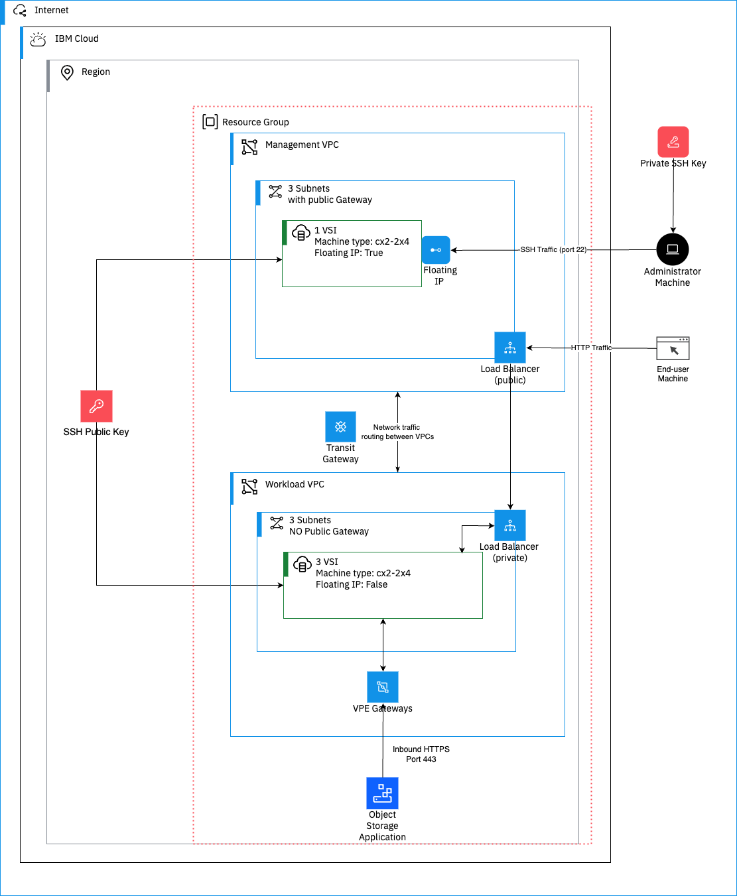

---

copyright:
  years: 2026
lastupdated: "2026-03-25"

keywords: Secure Hub-and-Spoke, Terraform IBM Modules, TIM Modules

subcollection: ibm-cloud-provider-for-terraform

---

{{site.data.keyword.attribute-definition-list}}

# Build a secure Hub-and-Spoke infrastructure using Terraform IBM Modules
{: #hub-spoke-infrastructure}
{: toc-content-type="tutorial"}
{: toc-services="terraform, tim, tim-modules"}
{: toc-completion-time="2h"}

This tutorial demonstrates how to build a complete **Infrastructure as Code (IaC)** solution on IBM Cloud using [Terraform IBM Modules](https://registry.terraform.io/namespaces/terraform-ibm-modules){: external}. Rather than defining individual cloud resources, you will focus on **assembling, integrating, and composing Terraform modules** into a cohesive, reusable solution. The infrastructure you'll build is based on a **secure hub-and-spoke model**.
{: shortdesc}

{: figure caption="IBM Cloud Hub-and-Spoke Infrastructure."}

## Understand the hub-and-spoke architecture
{: #hub-spoke-why}

This tutorial uses a hub-and-spoke network architecture, a standard pattern for isolating environments and controlling traffic flow. The design separates the Management (Hub) and Workload (Spoke) environments for better security and organization. The hub provides a secure entry point for administration and traffic, while the spokes host applications in an isolated environment. You will explore this architecture in detail in the next section.

The following are the advantages of using hub and spoke architecture:

- **Security isolation** — Workloads run in private VPCs with no direct internet exposure. The only path in is through the hub, where you control every entry point.
- **Centralized administration** — A single jumpbox in the hub provides SSH access to all spoke environments, giving administrators one place to manage access.
- **Controlled ingress** — Internet traffic enters through a public load balancer in the hub and is forwarded to a private load balancer in the spoke.
- **Private service access** — Spoke workloads connect to IBM Cloud services like Cloud Object Storage through Virtual Private Endpoints (VPEs), ensuring that data never traverses the public internet.
- **Scalability** — Additional spokes can be added for new environments (staging, production, partner workloads) without changing the hub design.

### Management VPC (The Hub)
{: #hub-spoke-management-vpc}

The Management VPC is the central control plane and secure entry point to your entire infrastructure. It contains:

- **Jumpbox Server:** Secure gateway for administrators to access workload servers. The only component reachable from the public internet (via SSH).
- **Public Load Balancer:** Routes incoming traffic to the private load balancer in the Workload VPC, keeping workload servers isolated.

### Workload VPC (The Spoke)
{: #hub-spoke-workload-vpc}

The Workload VPC is a fully private environment with no public gateways and no direct internet access. It contains:

- **Workload Servers:** Private virtual servers hosting applications, without direct internet access.
- **Private Load Balancer:** Distributes traffic from the public load balancer to workload servers.

### Secure connectivity
{: #hub-spoke-connectivity}

The infrastructure uses the following components to establish secure, private connectivity between VPCs and control traffic flow:

- **Transit Gateway:** Connects Management and Workload VPCs over the private IBM Cloud backbone.
- **Security Groups and Network ACLs:** Firewall rules that control traffic between the components.

### Private access to IBM Cloud services
{: #hub-spoke-private-access}

Workload servers access IBM Cloud services through private endpoints, ensuring data never traverses the public internet:

- **Virtual Private Endpoints (VPEs):** Enable private connections from workload servers to IBM Cloud services, such as Cloud Object Storage.

### End-to-end traffic flow
{: #hub-spoke-traffic-flow}

The following flow shows the complete end-to-end request path from the public internet through to IBM Cloud services:

**Internet → Public Load Balancer (Hub) → Transit Gateway → Private Load Balancer (Spoke) → Workload Server → VPE → Cloud Object Storage**

At no point does the workload server or its data leave the private network. The public load balancer is the only component exposed to the internet.

## Terraform IBM Modules used
{: #hub-spoke-tim-modules}

[Terraform IBM Modules](https://github.com/terraform-ibm-modules) are open-source, community-maintained building blocks that encode IBM Cloud best practices, input validation, and production-ready defaults into reusable components. This project composes the following modules to assemble the complete infrastructure — no low-level resource definitions required:

| Module | What it provides |
|---|---|
| [resource-group](https://github.com/terraform-ibm-modules/terraform-ibm-resource-group) | A logical container for all IBM Cloud resources, used for organization and IAM access control. |
| [landing-zone-vpc](https://github.com/terraform-ibm-modules/terraform-ibm-landing-zone-vpc) | VPC creation with subnets, public gateways, and network ACLs. Used for both the Management and Workload VPCs. |
| [transit-gateway](https://github.com/terraform-ibm-modules/terraform-ibm-transit-gateway) | Private connectivity between VPCs over the IBM Cloud backbone. |
| [landing-zone-vsi](https://github.com/terraform-ibm-modules/terraform-ibm-landing-zone-vsi) | Virtual server instances with security groups, floating IPs, and integrated load balancers. Used for both the jumpbox and workload servers. |
| [security-group](https://github.com/terraform-ibm-modules/terraform-ibm-security-group) | Standalone security groups for the public load balancer and VPE gateways. |
| [vpe-gateway](https://github.com/terraform-ibm-modules/terraform-ibm-vpe-gateway) | Virtual Private Endpoint gateways for private access to IBM Cloud services. |
| [cos](https://github.com/terraform-ibm-modules/terraform-ibm-cos) | Cloud Object Storage instance, bucket, and service credentials. |
{: caption="Terraform IBM Modules used in this project" caption-side="bottom"}

Each module is versioned and maintained by the Terraform IBM Modules team, giving you production-grade defaults, input validation, and documentation out of the box.

## What you will learn
{: #hub-spoke-learning-outcomes}

By going to the [repo](https://github.com/terraform-ibm-modules/sample-iac-solutions/tree/main/hub-and-spoke){: external} and doing this tutorial hands-on, you will gain practical experience with:

- **Composing Terraform modules** — Building infrastructure by assembling well-tested modules instead of writing resources from scratch.
- **VPC network design** — Creating hub-and-spoke topologies with proper CIDR planning, subnet isolation, and inter-VPC routing.
- **Layered security** — Applying defense-in-depth using Network ACLs at the subnet level and Security Groups at the instance level.
- **Load balancer chaining** — Exposing applications through a public-to-private load balancer chain that keeps workloads off the internet.
- **Private service connectivity** — Using Virtual Private Endpoints to access IBM Cloud services without public network exposure.
- **End-to-end validation** — Testing connectivity from jumpbox to workload servers and verifying the full request path from browser to Cloud Object Storage.

## Get started
{: #hub-spoke-get-started}

The complete Terraform configuration, deployment instructions, and validation steps are in the [repository](https://github.com/terraform-ibm-modules/sample-iac-solutions/tree/main/hub-and-spoke){: external}.

The repository [README](https://github.com/terraform-ibm-modules/sample-iac-solutions/blob/main/hub-and-spoke/README.md) walks you through cloning the project, deploying the infrastructure, and validating the end-to-end application flow.
