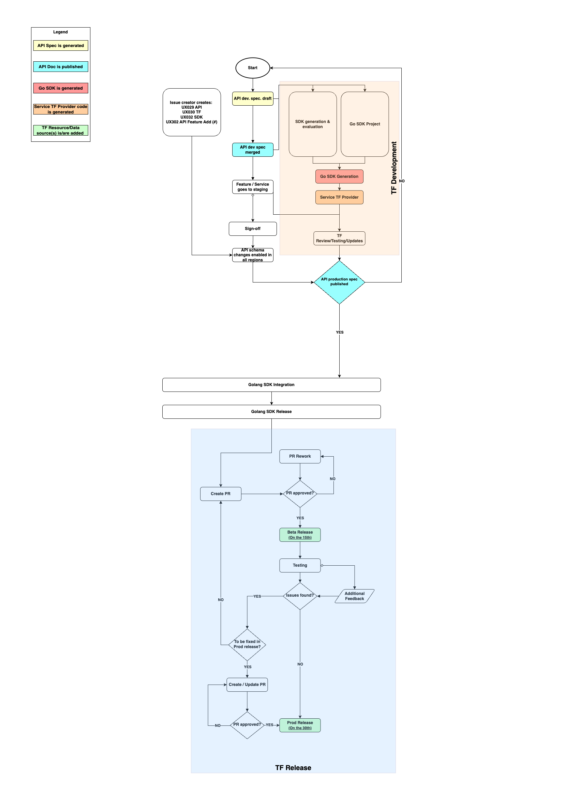

---

copyright: 
    years: 2017, 2024
lastupdated: "2024-03-15"

keywords: terraform, terraform ownership, transferring terraform ownership, service ownership, terraform development, terraform release

subcollection: ibm-cloud-provider-for-terraform

---

{{site.data.keyword.attribute-definition-list}}

# Creating and owning your Terraform provider
{: #tf-transfer-ownership}

IBM Cloud Services are most powerful when they can be seamlessly deployed by large enterprise customers in complex global-spanning and highly available configurations. Services need to ensure that they support this automation capability.

Terraform parity with API/UI/CLI capabilities is expected for most service features and functionalities (there are some services licensed to have limited provider availability/scope or no availability at all). Exceptions/limitations should be documented with the respective business justification/approval during the service (feature) planning and design phase.

Developing the Terraform provider is an ongoing enhancement for the {{site.data.keyword.cloud}} services. This would mean asking each service team to define a plan to deliver Terraform provider support for your service.

* TBU > For more information, about the service team adopting Terraform provider, see [Terraform provider ownership status](https://github.ibm.com/blueprint/terraform-getting-started/blob/master/Adopters.md).

Follow these steps to create your Terraform provider for the {{site.data.keyword.cloud_notm}} services.

1. [Planning your Terraform provider](#tf-support)
2. [Architecture](#tf-architecture)
3. [Creating Terraform resources and data sources](#tf-resource-datasource-creation)
4. [Maintaining Terraform resources and data sources](#tf-resource-datasource-maintain)
5. [Executing Terraform test cases](#tf-execute-test-cases)
6. [Creating Terraform documentation](#tf-tab)
7. [Creating Terraform provider issues](#tf-issues)

{: caption="Figure 1. Terraform Development & Release Overview" caption-side="bottom"}

## Planning
{: #tf-support}

Terraform has wide adoption as a declarative method for managing {{site.data.keyword.cloud_notm}} resources to automate the set-up of the {{site.data.keyword.cloud_notm}} accounts and services. You can review the automation requirements to provision and configure your service by using Terraform. Following the [schema guidance]((https://cloud.ibm.com/docs/api-handbook?topic=api-handbook-schemas)) in the API Handbook will be helpful in designing an [API definition/specification](https://test.cloud.ibm.com/docs/api-docs?topic=api-docs-get-started-api) that translates well to Terraform (though it is not sufficient to guarantee the API can be supported with Terraform).
Also review the existing services API, SDK, and the command line [design to identify](https://github.ibm.com/blueprint/terraform-getting-started/blob/master/Contribute.md#high-level-development-process){: external}, validate, and finalize your approach to develop the Terraform resources and data sources by using the Terraform provider.

## Architecture
{: #tf-architecture}

For the basic architecture of the {{site.data.keyword.cloud_notm}} Provider in the context of Terraform, refer to, [{{site.data.keyword.cloud_notm}} Terraform provider architecture](https://github.ibm.com/blueprint/terraform-getting-started/blob/master/Contribute.md#architecture){: external}.

To contribute to the {{site.data.keyword.cloud_notm}} provider refer to the [guidelines for contribution](https://github.ibm.com/blueprint/terraform-getting-started/blob/master/Contribute.md#guidelines-for-contribution){: external} repository. For getting started with Terraform, refer to [Terraform on IBM Cloud documentation](/docs/ibm-cloud-provider-for-terraform).

## Creating Terraform resources and data sources
{: #tf-resource-datasource-creation}

The [`OpenAPI SDK Generator`](https://github.ibm.com/CloudEngineering/openapi-sdkgen){: external} has the capability of generating a Terraform provider for your service. The code produced by the generator is combined with the code in the Terraform provider to produce a functioning Terraform provider for {{site.data.keyword.cloud_notm}}.  To generate a working Terraform provider, a working [`Go SDK`](https://test.cloud.ibm.com/docs/api-docs?topic=api-docs-sdk-info)) must be generated for your service. The generated Terraform provider depends on the generated `Go SDK`. Based on the complexity of your service, you may need to make manual edits to properly build and run generated Terraform provider code. Once the `Go SDK` is ready, Publish it in open-source, preferably, in this location: `http://github.com/IBM-Cloud/`.

You can generate a Terraform Provider for your service from an [OpenAPI SDK generator](https://github.ibm.com/CloudEngineering/openapi-sdkgen/wiki/Terraform-Provider-Generation){: external}. For any assistance in using `OpenAPI SDK generator` tool watch this [video tutorial](https://yourlearning.ibm.com/activity/PLAN-894B3F6170DE) and/or use `#ibm-terraform-generation` Slack channel.

To create the Terraform resources and data sources for your service, refer to, [Design guidance to develop the Terraform resources and data sources](https://github.ibm.com/blueprint/terraform-getting-started/blob/master/Contribute.md#design-guidance){: external}.

## Maintaining Terraform resources and data sources
{: #tf-resource-datasource-maintain}

The service team must constantly monitor the slack channels and the GitHub repositories for the issues raised by the periodic test automation that are performed by the {{site.data.keyword.cloud_notm}} Provider for Terraform team. 

You need to integrate the testing of the Terraform resources, data sources, modules and examples in your services by using the `CI/CD` pipelines. Also you need to ensure that the UI, command line and Terraform provider are synchronized.

For more information, about the maintaining Terraform resources and datasource, refer to [High development process](https://github.ibm.com/blueprint/terraform-getting-started/blob/master/Contribute.md#high-level-development-process){: external}.

## Executing Terraform test cases
{: #tf-execute-test-cases}

The acceptance tests are mandatory process to create the real resources as it often costs money to run. If you are unable to pay to run an acceptance tests for your contribution, you can mention in your [`Pull Request (PR)`](#raising-a-pr). {{site.data.keyword.cloud_notm}} Provider for Terraform team accepts the implementations of [acceptance tests](https://github.ibm.com/blueprint/terraform-getting-started/blob/master/Contribute.md#acceptance-tests){: external} at minimal and run them for your service. 

## Creating Terraform documentation
{: #tf-tab}

Typically, your development team will create this documentation in one of the following ways:

 1. Generating the Terraform docs along with the Terraform provider, resources, and data sources from the API definition using the process described [here](#creating-terraform-resources-and-data-sources)
 2. Manually writing and updating the docs if the Terraform provider, resources, and data sources are manually created

Generating the Terraform provider using option 1 is convenient and efficient, where not only resources, and data sources for your product/service are included, but also reference docs and examples. The reference documentation is generated to the `website/docs` directory in the output directory that contains the generated provider. The generated examples are in the examples directory under the same output directory.

After docs are generated, review them for consistency and pay close attention to the `Argument Reference` and `Attribute Reference` sections of the generated Markdown. These descriptions are pulled from the operation and parameter description fields in your API definition. The other sections in the generated docs are hardcoded in the generator and can't be customized by each service.

For more information on docs conventions and the publication process, see [Registry documentation steps](https://github.ibm.com/blueprint/terraform-getting-started/blob/master/Contribute.md#documentation){: external}, [Documenting Terraform provider usage](/docs/writing?topic=writing-documenting-terraform) and [Documenting how to use Terraform with your service](/docs/writing?topic=writing-terraform-how-to).

## Raising a PR
{: #tf-prs}

To publish your service Terraform provider code do the following:
1. Fork the [repository](https://github.com/IBM-Cloud/terraform-provider-ibm), add your code changes and raise a PR for review. Use [#terraform-ibmcloud-adopters](https://ibm.enterprise.slack.com/archives/C014T9VQL5P) to notify about your PR.

2. One team member from terraform-provider-ibm will take a look at the PR, will either approve it or give comments if anything more needed to be done.

3. Once all the comments and checklists are done, your contributions will be merged into the codebase. Contributions that are merged will be included into the next release of the provider.

## Creating Terraform provider issues
{: #tf-issues}

The Terraform team handles the support tickets through the [{{site.data.keyword.cloud_notm}} Schematics support](https://github.ibm.com/blueprint/schematics-support-tickets){: external} Slack channel, and the tickets will be routed to your services.
